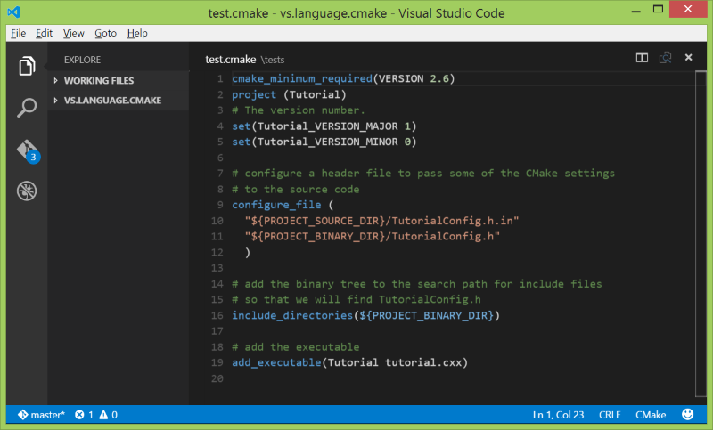

# vs.language.cmake

Syntax highlighting for [Cmake](http://www.cmake.org/) in [Visual Studio Code](https://code.visualstudio.com/)




# Installation 
on Windows, run a console prompt as administrator and create a simlink to the source in the vscode plugins directory

```
cd %LocalAppData%/Code/app-0.3.0/resources/app/plugins
mklink vs.language.cmake path_to_cloned_repository
```


