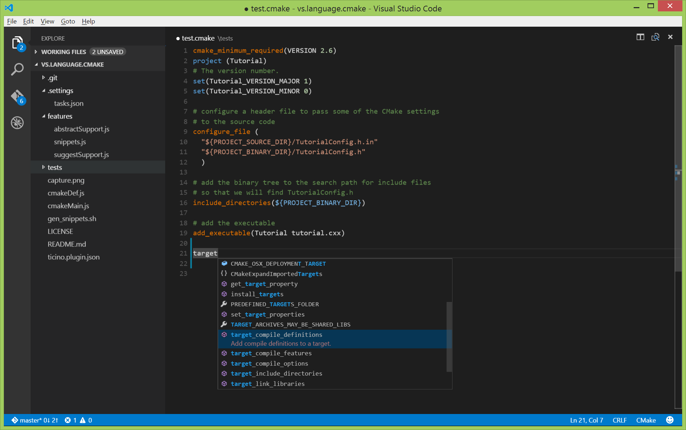
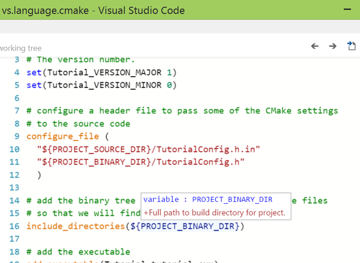

# vs.language.cmake

Experimental extension for [Cmake](http://www.cmake.org/) in [Visual Studio Code](https://code.visualstudio.com/) 0.8.0



## Features
- Colorization
- Completion Lists 
- Snippets
- Quick Help 

## Install
on Windows, run a console prompt as administrator and create a simlink to the source in the vscode plugins directory

```
mklink "%programfiles(x86)%/Microsoft VS Code/resources/app/plugins/vs.language.cmake" path_to_cloned_repository
```

## License
[MIT](LICENSE)